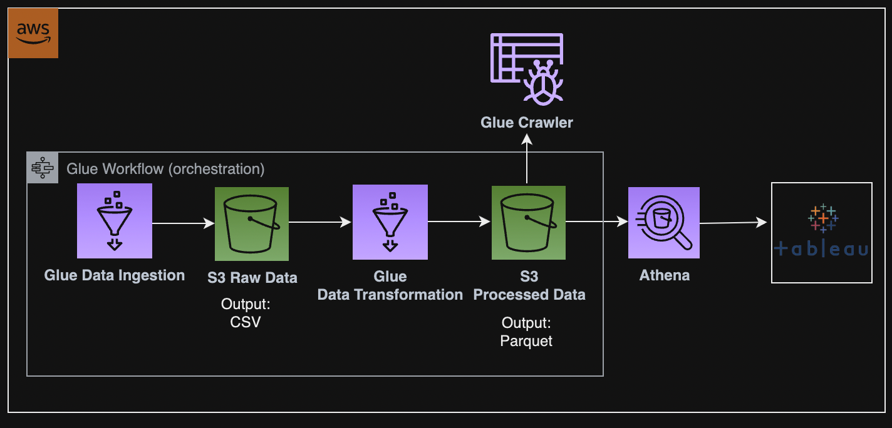
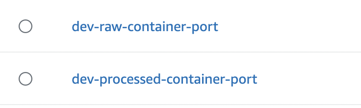
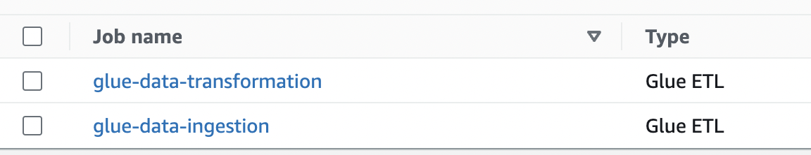
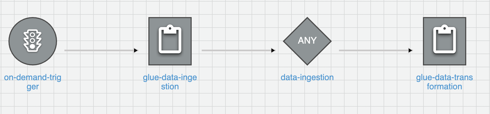
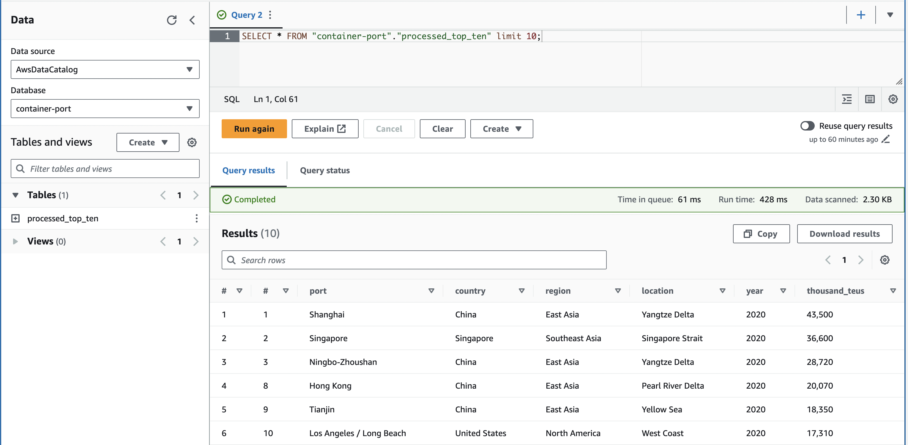
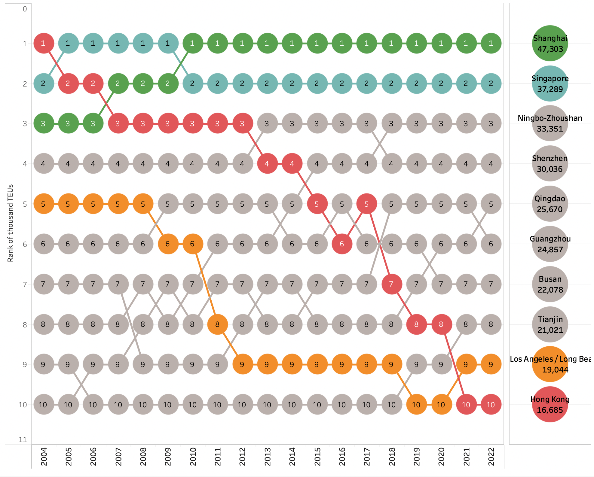

# Building a Simple Data Pipeline: Leveraging AWS for Enriching Data from Wiki to Tableau Visualisation

In the pursuit of data enrichment, the demand for external data sources is undeniable. This project shows the construction of a simple data pipeline for extracting data from the Wiki. The architecture integrates AWS services, including S3 for data storage, Glue Workflow for orchestration, Glue Jobs for Extract, Transform, Load (ETL) operations, and Athena as an interactive query service. The final touch involves the integration with Tableau, a visualization platform.

## 1. Diagram

## 2. Steps

 2.1 Data Storage Layers

To ensure a structured approach to data management, I establish a clear distinction between raw and processed datasets by creating two folders in this project. Generally data is categorized into three layers following the Medallion Architecture best practices:

- Bronze (Raw): This layer stores the raw data extracted from the Wiki source.

- Silver: After cleansing and standardization, data is transformed into a standardized format, ready for further processing.

- Gold: The gold layer represents data in its final state, refined and optimized for consumption.

 2.2 Glue Jobs for Ingestion and Transformation

Two Glue jobs are created to handle the ingestion and transformation of data. The initial Glue job efficiently exports raw data as a CSV, setting the stage for subsequent processing. The second Glue job performs the data transformation, exporting the refined data as a Parquet file, a columnar storage format optimized for analytics. While the primary focus is often on Parquet's optimization in analytics, it's also important to highlight additional advantages: File size reduction and S3 storage cost reduction.

 2.3 Schema Extraction with Glue Crawler

Glue Crawler extracts essential schema information from the dataset.

 2.4 Orchestration with Glue Workflow

To streamline the data pipeline, a Glue workflow is created for orchestration. This workflow, customizable to trigger on-demand or scheduled runs, ensures the smooth flow of data through each processing step, enhancing overall efficiency.

 2.5 Athena: Interactive Query Service

Amazon Athena is an interactive query service, offering the simplicity of analyzing data directly in the S3 storage using standard SQL. This step allows for on-the-fly querying, enabling swift exploration of the enriched dataset.

 2.6 Integration with Tableau for Visualization

The final step involves integrating Athena with Tableau. The visualization provides a comprehensive list of the world's busiest container ports, showcasing container traffic in thousand TEUs.

Sources:

https://www.databricks.com/glossary/medallion-architecture

https://en.wikipedia.org/wiki/List_of_busiest_container_ports